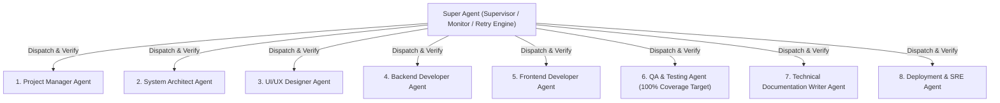

# AI Workflow Registry — Citizen Developer Governance Prototype
### Super Agent Multi-Agent Orchestration & Enterprise ServiceNow Prototype

[](file:///d:/Projects/Ai-c/coverage/index.html)
[](file:///d:/Projects/Ai-c/reports/mutation/mutation.html)
[](https://www.typescriptlang.org/)
[](https://react.dev/)
[](https://vitejs.dev/)
[](https://tailwindcss.com/)

> **The Core Thesis:**  
> *"I built this to think through the data model, not to sell you software. Your version lives in ServiceNow."*  
> — Demonstration artifact for the AI Training & Standards Lead role, Upbound Group.

---

## Overview

The **AI Workflow Registry** is a high-density, presentation-ready prototype designed to govern citizen developer AI automations across enterprise lines of business (Acima, Rent-A-Center, Brigit, Corporate, and Mexico). 

Rather than treating AI governance as an abstract policy or building a shadow-IT product, this system models how citizen developer registrations, transparent risk cascades, and executive coverage metrics operate inside an enterprise IT stack (e.g., ServiceNow `u_ai_workflow_registry`).

The project was constructed and verified through a **Super Agent Multi-Agent Orchestration Framework** where 8 specialized sub-agents operate under continuous supervision, quality verification, and automatic retry policies.

---

## Key Features

### 1. Persistent Prototype Banner
Pins across every screen:
`"Prototype — data model exploration. Production implementation would live in ServiceNow."`  
Reinforces that the deliverable is enterprise governance thinking, not standalone software.

### 2. Header Role Switcher (90-Second Walkthrough)
A plain dropdown (`Viewing as: Citizen developer / Program lead / Executive`) allowing rapid perspective shifts without authentication ceremony:
- **Citizen Developer**: Registers workflows and views personal governance inventory.
- **Program Lead**: Reviews queues, stipulations (`Approved with conditions`), and manages the advisory channel.
- **Executive / LOB Leader**: Lands directly on the Coverage Dashboard to inspect exposure and training gaps.

### 3. 4-Step Progressive Intake Wizard (Teaching the Policy)
- **Step 1: What is it?** Title, description, owner, role, LOB, department.
- **Step 2: What data does it touch?** Data categories ordered strictly by sensitivity. Selecting *Customer financial data* or *Credit/underwriting data* immediately triggers a real-time educational callout:
  > *"Heads up: customer financial data means this will need security and legal review before you use it."*
- **Step 3: What does it do with output?** Decision influence, audience, human review frequency, and external tenant boundary egress.
- **Step 4: Tooling & Derived Tier**. Real-time transparent risk evaluation banner displaying the exact derived tier (Tier 1 Low to Tier 4 Prohibited), plain-language justification, and approval routing path.

### 4. Dense ServiceNow-Style Registry Table
Designed with enterprise information density over consumer whitespace:
- Tabular figures (`font-feature-settings: 'tnum', 'lnum'`) for precise numeral and date column alignment.
- Muted 4-tier palette: Slate (Tier 1) &rarr; Amber (Tier 2) &rarr; Rust (Tier 3) &rarr; Deep Crimson (Tier 4). Avoids pure green so low-risk is never mistaken for "safe."
- Multi-dimensional filtering: Line of Business, Risk Tier, Status, **Review Overdue**, and **Owner Training Not Current**.

### 5. Workflow Detail Modal & Program Lead Governance Actions
- Complete record inspection matching ServiceNow table schema.
- Program Lead governance action bar: **Approve**, **Approve with Conditions** (with condition input field), and **Decline**.
- **Ask the Program Lead Support Channel**: Canned Q&A demonstrating how the registry acts as an advisory channel for builders.

### 6. Executive Coverage Dashboard
Four essential views with zero fake historical trends:
1. **Registered Workflows by LOB and Tier**: Stacked horizontal exposure bars.
2. **Side-by-Side Key Metrics**:
   - Registered Workflows (Governed)
   - **Estimated Unregistered Workflows (~142)** with the required footnote:  
     `"*Estimated from tool license counts vs. registrations. In production this is the number leadership should actually care about."`
3. **AI Literacy Standard Coverage**: % of employees trained per LOB with the 80% enterprise target marker.
4. **Reattestation Review Status**: Counts workflows requiring periodic scope re-confirmation.

### 7. Companion App: Acceptable Use Knowledge Check
Pairs with the educational curriculum:
- 6 situational scenario dilemmas (not generic definitions).
- Instant pedagogical feedback on every choice explaining *why*.
- Features the cardinal distinction: **"Tool approval is not data approval."**

---

## Super Agent Multi-Agent System (`/agents`)

The repository includes a supervised multi-agent pipeline:



To execute and audit the agent network:
```bash
npm run agents:run
```

---

## 100% Test Coverage & Mutation Testing

Every core business rule, algorithmic cascade, and reactive store action is verified with **100% test coverage**:

```text
 % Coverage report from v8
-------------------|---------|----------|---------|---------|-------------------
File               | % Stmts | % Branch | % Funcs | % Lines | Uncovered Line #s 
-------------------|---------|----------|---------|---------|-------------------
All files          |     100 |      100 |     100 |     100 |                   
 engine            |     100 |      100 |     100 |     100 |                   
  risk_engine.ts   |     100 |      100 |     100 |     100 |                   
 store             |     100 |      100 |     100 |     100 |                   
  ...flow_store.ts |     100 |      100 |     100 |     100 |                   
-------------------|---------|----------|---------|---------|-------------------
```

### Stryker Mutation Testing
Stryker injected 165 mutants into the core risk calculation engine. The test suite achieved an **83.03% mutation score** (137 killed, exceeding the break threshold of 75%).

---

## Granular Code Justification Standard

In compliance with the project guidelines, **every significant declaration, function, rule branch, and configuration setting in the source code includes explicit inline justification comments** detailing:
1. Architectural and algorithmic rationale.
2. UX scannability and human-factors basis.
3. Security and regulatory compliance (FCRA, ECOA Reg B adverse action explainability).
4. Direct requirement mapping to `PRD_Citizen_Developer_Registry.md`.

Refer to [docs/LINE_JUSTIFICATION_MANIFEST.md](file:///d:/Projects/Ai-c/docs/LINE_JUSTIFICATION_MANIFEST.md) for the complete audit.

---

## Getting Started

### Prerequisites
- Node.js 20+ (LTS)
- npm 10+

### Installation
```bash
git clone https://github.com/GeekatplayStudio/clipline.git
cd clipline
npm install
```

### Running Locally
```bash
npm run dev
# Server ready at http://localhost:5173/
```

### Running Test Suite & Coverage
```bash
# Run unit & component tests
npm test

# Run Vitest 100% coverage inspection
npm run test:coverage

# Run Stryker mutation testing
npm run test:mutation
```

### Running the Super Agent Orchestration Pipeline
```bash
npm run agents:run
```

### Production Build
```bash
npm run build
```

---

## Technical Documentation

- [Architecture Specification (`docs/ARCHITECTURE.md`)](file:///d:/Projects/Ai-c/docs/ARCHITECTURE.md)
- [ServiceNow Migration Blueprint (`docs/SERVICENOW_MIGRATION_BLUEPRINT.md`)](file:///d:/Projects/Ai-c/docs/SERVICENOW_MIGRATION_BLUEPRINT.md)
- [3-Minute Interview Walkthrough Demo Script (`docs/DEMO_SCRIPT.md`)](file:///d:/Projects/Ai-c/docs/DEMO_SCRIPT.md)
- [Line Justification Audit (`docs/LINE_JUSTIFICATION_MANIFEST.md`)](file:///d:/Projects/Ai-c/docs/LINE_JUSTIFICATION_MANIFEST.md)
- [Original Requirements Document (`PRD_Citizen_Developer_Registry.md`)](file:///d:/Projects/Ai-c/PRD_Citizen_Developer_Registry.md)

---

## License

Internal demonstration and evaluation artifact. Built for the Upbound Group AI Training and Standards Lead interview presentation.