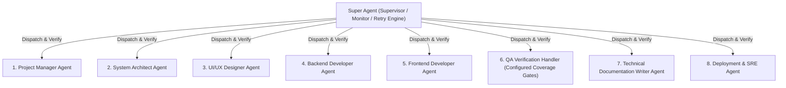

# AI Workflow Registry — Citizen Developer Governance Prototype

### Enterprise ServiceNow Data-Model Prototype and Verification Harness

[](coverage/index.html)
[](reports/mutation/mutation.html)
[](https://www.typescriptlang.org/)
[](https://react.dev/)
[](https://vitejs.dev/)
[](https://tailwindcss.com/)

> **The Core Thesis:**  
> _"I built this to think through the data model, not to sell you software. Your version lives in ServiceNow."_  
> — Demonstration artifact for the AI Training & Standards Lead role, Upbound Group.

---

## Overview

The **AI Workflow Registry** is a high-density, presentation-ready prototype designed to govern citizen developer AI automations across enterprise lines of business (Acima, Rent-A-Center, Brigit, Corporate, and Mexico).

Rather than treating AI governance as an abstract policy or building a shadow-IT product, this system models how citizen developer registrations, transparent risk cascades, and executive coverage metrics operate inside an enterprise IT stack (e.g., ServiceNow `u_ai_workflow_registry`).

The repository also contains a role-oriented verification harness. Its agent classes model ownership and record execution telemetry; they are not autonomous code-generation agents. The QA and deployment stages execute the real test and production-build commands.

---

## Key Features

### 1. Persistent Prototype Banner

Pins across every screen:
`"Prototype — data model exploration. Production implementation would live in ServiceNow."`  
Reinforces that the deliverable is enterprise governance thinking, not standalone software.

### 2. Header Role Switcher (90-Second Walkthrough)

A plain dropdown (`Viewing as: Citizen developer / Program lead / Executive`) allowing rapid perspective shifts without authentication ceremony:

- **Citizen Developer**: Registers workflows and views personal governance inventory.
- **Program Lead**: Reviews queues, stipulations (`Approved with conditions`), and manages the advisory channel.
- **Executive / LOB Leader**: Lands directly on the Coverage Dashboard to inspect exposure and training gaps.

### 3. 4-Step Progressive Intake Wizard (Teaching the Policy)

- **Step 1: What is it?** Title, description, owner, role, LOB, department.
- **Step 2: What data does it touch?** Data categories ordered strictly by sensitivity. Selecting _Customer financial data_ or _Credit/underwriting data_ immediately triggers a real-time educational callout:
  > _"Heads up: customer financial data means this will need security and legal review before you use it."_
- **Step 3: What does it do with output?** Decision influence, audience, human review frequency, and external tenant boundary egress.
- **Step 4: Tooling & Derived Tier**. Real-time transparent risk evaluation banner displaying the exact derived tier (Tier 1 Low to Tier 4 Prohibited), plain-language justification, and approval routing path.

### 4. Dense ServiceNow-Style Registry Table

Designed with enterprise information density over consumer whitespace:

- Tabular figures (`font-feature-settings: 'tnum', 'lnum'`) for precise numeral and date column alignment.
- Muted 4-tier palette: Slate (Tier 1) &rarr; Amber (Tier 2) &rarr; Rust (Tier 3) &rarr; Deep Crimson (Tier 4). Avoids pure green so low-risk is never mistaken for "safe."
- Multi-dimensional filtering: Line of Business, Risk Tier, Status, **Review Overdue**, and **Owner Training Not Current**.

### 5. Workflow Detail Modal & Program Lead Governance Actions

- Complete record inspection matching ServiceNow table schema.
- Program Lead governance action bar: **Approve**, **Approve with Conditions** (with condition input field), and **Decline**.
- **Ask the Program Lead Support Channel**: Canned Q&A demonstrating how the registry acts as an advisory channel for builders.

### 6. Executive Coverage Dashboard

Four essential views with zero fake historical trends:

1. **Registered Workflows by LOB and Tier**: Stacked horizontal exposure bars.
2. **Side-by-Side Key Metrics**:
   - Registered Workflows (Governed)
   - **Estimated Unregistered Workflows (~142)** with the required footnote:  
     `"*Estimated from tool license counts vs. registrations. In production this is the number leadership should actually care about."`
3. **AI Literacy Standard Coverage**: % of employees trained per LOB with the 80% enterprise target marker.
4. **Reattestation Review Status**: Counts workflows requiring periodic scope re-confirmation.

### 7. Companion App: Acceptable Use Knowledge Check

Pairs with the educational curriculum:

- 6 situational scenario dilemmas (not generic definitions).
- Instant pedagogical feedback on every choice explaining _why_.
- Features the cardinal distinction: **"Tool approval is not data approval."**

---

## Role-Oriented Verification Harness (`/agents`)

The repository includes a supervised multi-agent pipeline:



To execute and audit the agent network:

```bash
npm run agents:run
```

---

## Testing, Coverage Scope, and Mutation Testing

Run `npm run verify` for the 500-line module gate, type checking, tests, scoped coverage, production build, and bundle budgets. Coverage is reported for `src/engine/**` and `src/store/**`, where the deterministic business rules live. It is not a claim of 100% whole-application coverage.

Coverage gates are 90% for lines, statements, and functions and 85% for branches. UI behavior is covered by focused component tests but is not included in the core percentage.

### Stryker Mutation Testing

Stryker injected 176 mutants into the core risk calculation engine. The test suite achieved a **96.02% mutation score** (169 killed, exceeding the enforced break threshold of 90%).

---

## Engineering Decision Comments

Comments document non-obvious governance, human-factors, and regulatory decisions. Routine syntax should remain self-explanatory; comments are not a substitute for clear names, tests, or architecture boundaries.

---

## Getting Started

### Prerequisites

- Node.js 20+ (LTS)
- npm 10+

### Installation

```bash
git clone <repository-url>
cd <repository-directory>
npm ci
```

### Running Locally

```bash
npm run dev
# Server ready at http://localhost:5173/
```

### Running Test Suite & Coverage

```bash
# Run unit & component tests
npm test

# Run scoped core-domain coverage inspection
npm run test:coverage

# Run Stryker mutation testing
npm run test:mutation

# Run type checking, tests, coverage, and production build
npm run verify
```

### Running the Role-Oriented Verification Harness

```bash
npm run agents:run
```

### Production Build

```bash
npm run build
```

---

## Technical Documentation

- [Architecture Specification (`docs/ARCHITECTURE.md`)](docs/ARCHITECTURE.md)
- [Engineering Quality Standard (`docs/ENGINEERING_QUALITY.md`)](docs/ENGINEERING_QUALITY.md)
- [ServiceNow Migration Blueprint (`docs/SERVICENOW_MIGRATION_BLUEPRINT.md`)](docs/SERVICENOW_MIGRATION_BLUEPRINT.md)
- [3-Minute Interview Walkthrough Demo Script (`docs/DEMO_SCRIPT.md`)](docs/DEMO_SCRIPT.md)
- [Original Requirements Document (`PRD_Citizen_Developer_Registry.md`)](PRD_Citizen_Developer_Registry.md)

## Prototype Boundaries

This is a client-side demonstration artifact. Browser storage is not an authoritative system of record and the role switcher is not authentication. Automated tool-safety results are preliminary triage: certification, retention, training-use, and contractual claims remain unverified until supported by reviewed evidence. Production use requires server-side authorization, immutable audit history, schema migrations, real vendor evidence, observability, and ServiceNow integration.

---

## License

Internal demonstration and evaluation artifact. Built for the Upbound Group AI Training and Standards Lead interview presentation.
