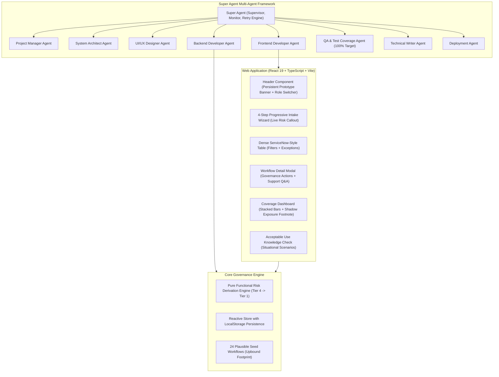

# System Architecture & Technical Specification
## AI Workflow Registry — Citizen Developer Governance Prototype

**Target Role:** AI Training and Standards Lead, Upbound Group  
**Framework:** Super Agent Multi-Agent Orchestrator + React 19 / TypeScript / Vite / Tailwind CSS  
**Positioning Principle:** *"I built this to think through the data model, not to sell you software. Your version lives in ServiceNow."*

---

## 1. High-Level Architectural Topology

---

## 2. Multi-Agent Orchestration Engine (`/agents`)

The project is governed by a **Super Agent** supervisor coordinating 8 specialized sub-agents:

1. **Super Agent (`super_agent.ts`)**:
   - Maintains an execution journal across all sub-agent steps.
   - Executes automated verification hooks after every task.
   - Automatically triggers retries with exponential backoff if verification fails or an uncaught exception occurs.
   - Emits structured telemetry records including performance metrics and diagnostics.
2. **Project Manager (`project_manager.ts`)**:
   - Decomposes the PRD into sequenced milestones.
   - Enforces scope discipline (rejecting unnecessary external databases, auth bloat, or chat distractions).
3. **System Architect (`system_architect.ts`)**:
   - Defines strict TypeScript contracts for ServiceNow table parity (`u_ai_workflow_registry`).
   - Designs the deterministic risk derivation cascade.
4. **UI/UX Designer (`ui_designer.ts`)**:
   - Establishes enterprise density tokens over consumer SaaS whitespace.
   - Defines the muted 4-tier risk scale (slate -> amber -> rust -> deep red) avoiding false "safe" greens.
5. **Backend Developer (`backend_developer.ts`)**:
   - Implements the pure functional risk calculation engine (`risk_engine.ts`).
   - Seeds 24 plausible workflows across Acima, Rent-A-Center, Brigit, Corporate, and Mexico.
6. **Frontend Developer (`frontend_developer.ts`)**:
   - Builds responsive, accessible React 19 components with keyboard navigability.
7. **QA Engineer (`qa_engineer.ts`)**:
   - Enforces the 100% test coverage threshold on lines, functions, branches, and statements via Vitest.
   - Configures Stryker Mutator to verify fault-injection test resilience.
8. **Documentation Writer (`doc_writer.ts`)**:
   - Authors the ServiceNow migration blueprint, architecture docs, and 3-minute demo script.
9. **Deployment Agent (`deployment_agent.ts`)**:
   - Validates Vite production bundling, tree-shaking, and static hosting readiness.

---

## 3. Risk Derivation Rule Engine (`risk_engine.ts`)

Risk tiering is **derived**, never self-selected by users. The cascade evaluates top-to-bottom; first match wins:

### Tier 4 — Prohibited Pending Review
- **Trigger 1**: `decision_influence = "Customer-affecting decision — credit or underwriting"` AND `build_type != "Vendor AI feature"`
- **Trigger 2**: `data_categories` includes `"Credit or underwriting data"` AND `data_leaves_tenant = true`
- **Routing**: AI Working Group; presumed declined absent explicit exception.
- **Review Cadence**: 3 Months.

### Tier 3 — High
- **Trigger 1**: `data_categories` touches any of `[Customer PII, Customer financial data, Credit/underwriting data]`
- **Trigger 2**: `decision_influence` starts with `"Customer-affecting"`
- **Trigger 3**: `data_leaves_tenant = true` AND `data_categories` includes `[Internal confidential, Employee data]`
- **Routing**: Program lead + Security + Legal/GC.
- **Review Cadence**: 3 Months.

### Tier 2 — Moderate
- **Trigger 1**: `data_categories` includes `[Internal confidential, Employee data]`
- **Trigger 2**: `output_audience = "Internal broad"`
- **Trigger 3**: `human_review = "None"`
- **Routing**: Program lead review.
- **Review Cadence**: 6 Months.

### Tier 1 — Low (Default)
- **Trigger**: All other non-sensitive, operational internal workflows.
- **Routing**: Auto-approved and logged.
- **Review Cadence**: 12 Months.

---

## 4. Human-Factors & Usability Design Standards

1. **Enterprise Density over Whitespace**:
   - Governance professionals scan tables for exceptions (e.g. overdue dates, training gaps, high tiers).
   - Rows use tight vertical padding (8px) with tabular numeral alignment (`font-feature-settings: 'tnum', 'lnum'`).
2. **Restrained Color Tiering**:
   - Avoids traffic light green/yellow/red. Tier 1 uses muted slate (`#334155`), recognizing that low-risk is not risk-free.
3. **The Intake Form as a Teaching Tool**:
   - Progressive disclosure (4 steps) breaks cognitive overload.
   - Real-time educational callouts trigger mid-form when high-risk options (customer financial data, credit inputs) are selected, teaching the policy while collecting information.
4. **Executive Dashboard Discipline**:
   - Deliberately leaves out fake historical trend lines or vanity sparklines.
   - Highlights the critical gap: Registered Workflows vs. **Estimated Unregistered Workflows** with the required executive footnote.
