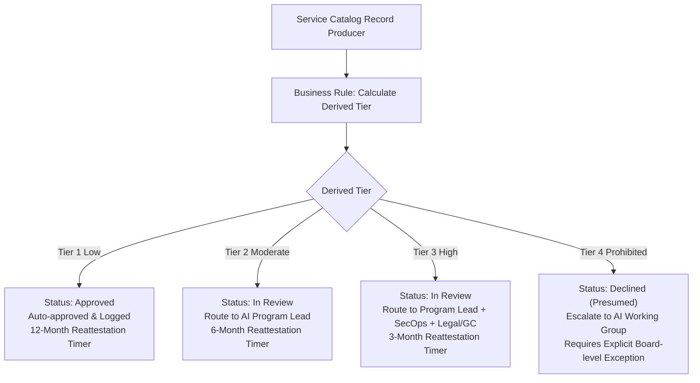

# ServiceNow Migration Blueprint
## AI Workflow Registry Integration Plan

**Author:** Vladimir Chopine  
**Target Platform:** ServiceNow Enterprise Service Management (ESM)  
**Target Table:** `u_ai_workflow_registry`  
**Purpose:** Provide the technical translation layer to migrate the citizen developer registry prototype into ServiceNow without creating shadow IT systems.

---

## 1. Table Schema: `u_ai_workflow_registry`

| Field Name | Type | Mandatory | Choice Values / References | ServiceNow Purpose |
|---|---|---|---|---|
| `u_number` | Number (Auto-numbered) | Yes | Prefix: `AIW-`, Digits: 4 | Human-quotable governance identifier. |
| `u_title` | String (100) | Yes | Plain text | Functional name of the workflow. |
| `u_description` | String (1000) | Yes | Multi-line text | Explanation in builder's words. |
| `u_owner` | Reference | Yes | `sys_user` | Employee responsible for the workflow. |
| `u_owner_role` | String (100) | No | Text | Title of the owner at registration time. |
| `u_lob` | Choice | Yes | `acima`, `rent_a_center`, `brigit`, `mexico`, `corporate` | Line of business owning the risk. |
| `u_department` | Reference | Yes | `cmn_department` | Department hierarchy. |
| `u_tools_used` | List | Yes | Choices: OpenAI, Claude, Copilot, Gemini, Power Automate, etc. | Tool inventory tracking. |
| `u_build_type` | Choice | Yes | `prompt`, `automation`, `custom_script`, `vendor_ai`, `agent` | Architecture categorization. |
| `u_data_categories` | List | Yes | Sensitivity scale choices | **Primary driver of risk classification.** |
| `u_decision_influence`| Choice | Yes | Informational to Credit/Underwriting | **Critical regulatory risk driver.** |
| `u_output_audience` | Choice | Yes | `just_me`, `team`, `broad_internal`, `customer_facing` | Blast radius metric. |
| `u_data_leaves_tenant`| True/False | Yes | Default: false | Boundary egress flag. |
| `u_human_review` | Choice | Yes | `every`, `sampled`, `none` | Oversight factor. |
| `u_risk_tier` | Choice (Read-only) | Yes | `tier1_low`, `tier2_mod`, `tier3_high`, `tier4_prohib` | Derived by business rule. |
| `u_risk_reason` | String (1000) | Yes | Read-only | Explainability log for audit. |
| `u_status` | Choice | Yes | `draft`, `submitted`, `in_review`, `approved`, `conditional`, `declined`, `retired` | State machine. |
| `u_conditions` | String (1000) | No | Plain text | Populated when conditionally approved. |
| `u_review_due` | Date | Yes | Auto-calculated | Reattestation schedule. |
| `u_training_current` | True/False | Yes | Synced from LMS | Flag linking training completion. |

---

## 2. Business Rule: Automated Derived Risk Calculation

**Trigger:** Before Insert / Before Update on `u_ai_workflow_registry`.  
**Script Name:** `BR_Derive_AI_Risk_Tier`

```javascript
(function executeRule(current, previous /*null when async*/) {
    var dataCats = current.u_data_categories.toString();
    var decision = current.u_decision_influence.toString();
    var buildType = current.u_build_type.toString();
    var leavesTenant = current.u_data_leaves_tenant == true;
    var audience = current.u_output_audience.toString();
    var humanReview = current.u_human_review.toString();

    // Tier 4: Credit underwriting custom or sensitive egress
    if ((decision == 'credit_underwriting' && buildType != 'vendor_ai') ||
        (dataCats.indexOf('credit_underwriting_data') > -1 && leavesTenant)) {
        current.u_risk_tier = 'tier4_prohib';
        current.u_risk_reason = 'Tier 4 — Prohibited pending review. Custom credit decisioning or credit data egress detected. Presumed declined absent AI Working Group exception.';
        current.u_review_due = gs.monthsAgo(-3);
        return;
    }

    // Tier 3: Sensitive consumer data or customer decisions
    if (dataCats.indexOf('customer_pii') > -1 ||
        dataCats.indexOf('customer_financial') > -1 ||
        dataCats.indexOf('credit_underwriting_data') > -1 ||
        decision.startsWith('customer_affecting') ||
        (leavesTenant && (dataCats.indexOf('internal_confidential') > -1 || dataCats.indexOf('employee_data') > -1))) {
        current.u_risk_tier = 'tier3_high';
        current.u_risk_reason = 'Tier 3 — High. Touches sensitive consumer data, influences customer decisions, or transits confidential data outside tenant.';
        current.u_review_due = gs.monthsAgo(-3);
        return;
    }

    // Tier 2: Internal confidential or broad audience or no human review
    if (dataCats.indexOf('internal_confidential') > -1 ||
        dataCats.indexOf('employee_data') > -1 ||
        audience == 'broad_internal' ||
        humanReview == 'none') {
        current.u_risk_tier = 'tier2_mod';
        current.u_risk_reason = 'Tier 2 — Moderate. Internal confidential records, broad audience distribution, or zero human oversight.';
        current.u_review_due = gs.monthsAgo(-6);
        return;
    }

    // Tier 1: Baseline Low Risk
    current.u_risk_tier = 'tier1_low';
    current.u_risk_reason = 'Tier 1 — Low. Routine non-sensitive operational workflow with human oversight.';
    current.u_review_due = gs.monthsAgo(-12);
    if (current.u_status == 'submitted') {
        current.u_status = 'approved'; // Auto-approved and logged
    }
})(current, previous);
```

---

## 3. Flow Designer: Approval & Reattestation Matrix



---

## 4. ServiceNow Executive Dashboard Implementation

The Executive view translates into a **Performance Analytics Dashboard**:
1. **Interactive Filter:** Line of Business (LOB).
2. **Breakdown Widget:** Stacked column showing active records by LOB grouped by Risk Tier.
3. **KPI Scorecard:** Count of Registered Workflows vs. **Estimated Unregistered** (derived by joining Okta / Azure AD SSO AI SaaS assignment counts minus registered records).
4. **Target Marker Widget:** Literacy % by LOB with 80% target reference line.
5. **Exception Report:** Workflows where `u_review_due < gs.now()` (Overdue reattestation).
